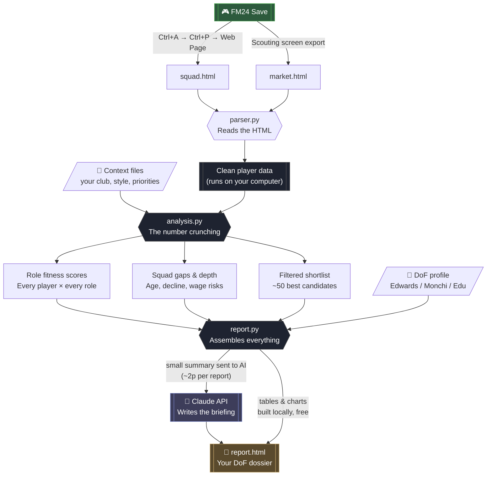
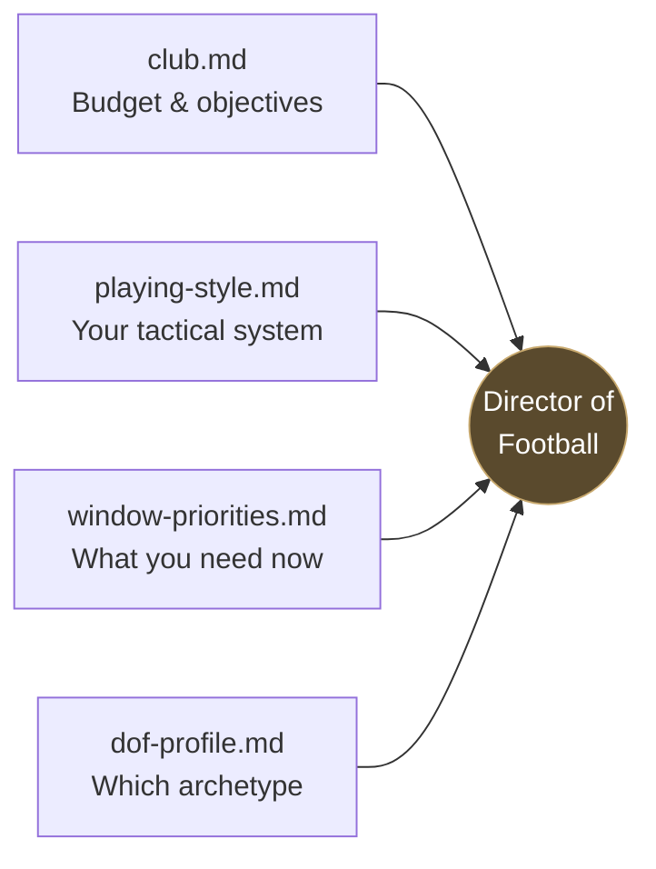

# 🔄 How FM Save Copilot Works

This document shows how all the pieces fit together — from your FM24 save to a finished Director of Football report.

---

## The big picture

---

## What happens at each stage

### 1. Export (you do this, in FM24)
You export two HTML files from your save — your squad, and the pool of players you could realistically sign. This is the only manual step, and it takes about 30 seconds once your view is set up.

### 2. Parsing (automatic, free, on your computer)
`parser.py` reads the messy HTML that FM produces and turns it into clean, structured data — every player's attributes, age, wage, positions, and value, ready to analyse.

### 3. Analysis (automatic, free, on your computer)
`analysis.py` is the brain. It:
- Scores every player against every role in **your** tactical system
- Identifies your squad's gaps, depth issues, decline risks, and wage imbalances
- Filters the entire market down to the best candidates for your specific needs

**None of this costs anything.** It's just maths running locally. Your player database never leaves your machine.

### 4. Report assembly (automatic, on your computer)
`report.py` takes all the analysis and builds the visual report — the tables, the depth matrix, the radar charts. Then it sends a **small summary** (just the shortlisted players and your squad analysis) to the AI.

### 5. The AI briefing (~2p, uses your API key)
The AI receives the summary plus your chosen **Director of Football profile** and writes the narrative: the executive summary, the reasoning behind each recommendation, the strategic plan. This is the only step that costs money.

### 6. Your report
Everything comes together as a single `report.html` file that opens in your browser.

---

## The context files — your club's DNA

- **`club.md`** — your budget, wage room, and board objectives (the constraints)
- **`playing-style.md`** — your formation, roles, and how you play (the north star — every player is judged against this)
- **`window-priorities.md`** — what you're looking to do this window
- **`dof-profile.md`** — which sporting director's philosophy shapes the analysis

You fill these in once at the start, then tweak them as your save evolves. The **Setup Wizard** (runs automatically after install) generates them through a set of simple questions.
